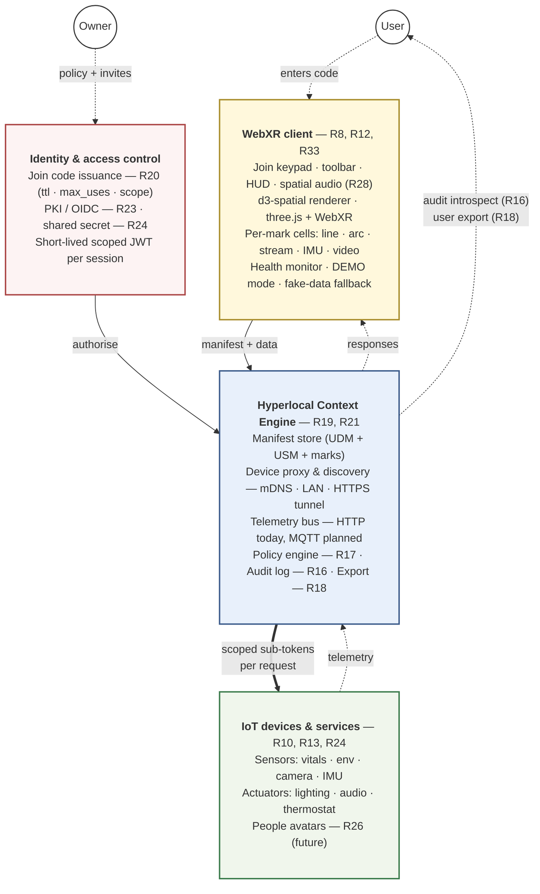
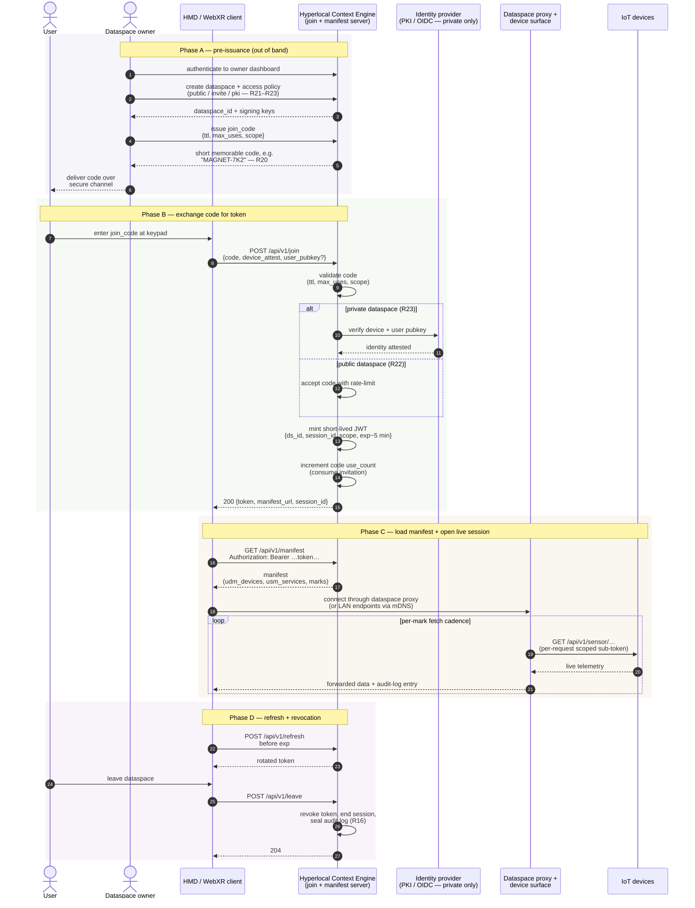

# Overview (v4)

The "Internet Of Things", popularly known as IoT, presented a unique way of looking at the nature of data, connectivity, security, and standards around small low power compute devices as they relate to people and the larger world.  "The WebXR of things" as a phrase expresses the ability to explore devices and places and even people,  in a spatial mixed reality sense.  This concept is expressed as a desire to allow XR to become the default interface to devices, places, people, and data.  The caveat to this statement, is, the user should have the option to "own" this tech stack, as opposed to the past 20+ years of computing, which largely operated through a gatekeepers deciding matters of privacy, ownership of copyright over data, collaboration with government (or not) and the right to monetize data.  Open standards are desired as an approach to deliver a stack owned by the consumer, self hosted, paid SaaS hosted, or for free with copyright of data granted to the owner of the stack.  This paper will also address the caveats and challenges in the current tech stacks for delivering the "WebXR of Things".  In this discussion, we will focus on the "hyperlocal" scale.  This implies the immediate area, within sight of the a user, within short range, within walking distance, and not the global scale.

## The Problem 

The promise of IoT offered the ability to introspect environments and communicate with a small but powerful compute devices living at the edge of network environments.  The reality has been, walled gardens dominate IoT.  Until recently, large gatekeepers have tried to avoid standards.  We now have an opportunity with strong OSS comunities to push the industry to adopt open standards, or use defacto high quality open source.  For WebXR, we don't yet have a way to explore the environment in a "hyperlocal" context, to instrospect IoT devices, people, places, and data or state.  There is currently no standard way to grab a popular WebXR device (an ipad, a Meta Quest 3, an Apple Vision Pro, Snap Spectacles) and "join" the local area / room / space to explore, introspect, and control services provided by devices.  Every other ecosystem has stronger capabilities.  TVs have more capabilities that WebXR devices in that they have native ways to explore services on a network and exploit them for positive use cases.  For WebXR what is needed is exploration of approaches to service discovery beyond the URL.  Current mechanisms require all communications to flow through "websites".  APIs to integrate with devices that might be worn or just inches or meters away are not available.  Hence, the exploration of "WebXR of Things" (or simply, the XrOT)  

## Inspirations

Attribution: Adam Varga (design concept)


Credit: https://www.linkedin.com/posts/dmvrg_unity-m5stack-arduino-activity-7341335884333531138-oHRI/?rcm=ACoAAAAIENgBAB7U7RX_Hl-tsAvNwMh3WO-qm4E

The above images evoke an idea that data and a virtually physical control surface are locked away in every device.

## References

- IoT:  https://en.wikipedia.org/wiki/Internet_of_things
- WebXR Specficiation: https://www.w3.org/TR/webxr/
- Three-Mesh-UI: https://github.com/felixmariotto/three-mesh-ui
- D3.js: https://d3js.org/

## Proposed Solution(s)

We propose to build a standard open source platform to allow WebXR users to explore the "hyperlocal" context (the area in the immediate vicinity around a user) via WebXR, exploring the personal range (wearables, or devices within reach of the user), roomscale range (within a room), or network scale (within the network), or as is always possible, Internet scale.  Users should be able introspect: services, data, devices, people (yes), and state within a hyperlocal  context, with the ultimiate goal being: this can work easily on different HMDs and Mixed Reality Glasses.

### Requirements

- R1: Cross Platform
- R2: Open Platform
- R3: Royalty Free Distribution possible
- R4: Documented and versioned API specifications
- R5: License free conformance suite available
- R6: An Open Source Reference Implementation is available
- R7: Self hosted
- R8: Works in a WebXR compatible context (implies WebXR secure context)
- R9: Doesn't require access front facing HMD / Mix Reality Glasses cameras to function
- R10: User can discover services
- R11: User is continuously aware of state (connection, security, network QoS)
- R12: User is optionally able to immerse (if available), and should be in Mixed Reality by default
- R13: User is able to interact with devices via XR UX (devices self describe their interfaces)
- R14: User is able to interact with data via XR UX (devices self describe data dashboards/viewers)
- R15: Hyperlocal Context Engine cannot be shut down by any single company, deprecated, or bought/sold.
- R16: User is able to introspect all data collected by the Context Engine
- R17: No data can leak out to 3rd party servers unless approved by the user.
- R18: User data is portable to other Hyperlocal Context Engine service providers
- R19: The Hyperlocal Context Engine provides a namespace, known as a dataspace to provide an area for devices and users to interact with services, data, people, and state.
- R20: The dataspaces should be easily memorized and short enough to be quickly used to join a dataspace
- R21: dataspaces are owned by an entity (a person, a device, an organization)
- R22: Any entity can join a public dataspace
- R23: private dataspaces will be secured by PKI to allow access
- R24: IoT devices can join dataspaces and can register with a shared secret
- R25: WebXR UX for device introspection will be defined in the UI Spec V1
- R26: WebXR UX for people introspection will be defined in the UI Spec V1
- R27: WebXR UX for service introspection will be defined in the UI Spec V1
- R28: WebXR UX for data dashboard introspection will be defined in the UI Spec V1
- R29: Shared experiences are possible in WebXR
- R30: Devices must define their own security (outside of the scope of this PoC)
- R31: Devices must define their capabilities to allow simultaneous control
- R32: Device comissioning is left to be an implementation detail, but assumed devices will be able to handle comissioning automatically if allowed to do so
- R33: At least 2 HMD/Mixed Reality Glasses are supported by the PoC

### Proposal A - locally hosted server behind proxy for hyperlocal context

We will build the architecture pictured below, with a a secure server used as dataspace data federation for hyperlocal context, meaning the HMD user can explore this registry on a hyperlocal scale, or any registry compliant with the apis. 

- The hyperlocal context engine is hosted on the web, self hosted
- The context is secured via HTTPS:// and WSS://using a self obtained valid SSL certificate
- The HMD/Mixed Reality Glasses will hit a known url (we will use hlxr.org ... hyperlocal XR) and obtain a temporary or permanent token and dataspace

#### Dataspace architecture

The dataspace is the central abstraction (**R19**): a namespace that binds together an identity/access boundary, a manifest describing what's in it, a device-and-service surface, and a WebXR client that renders all of the above. Each block below is a layer of the reference implementation and maps onto the requirements above.



Reading the diagram bottom-up: a user with an HMD enters a join code (R20) at the keypad on the WebXR client. That code is exchanged at the Identity layer for a short-lived JWT scoped to one dataspace + one session. The JWT authorises every subsequent request to the Hyperlocal Context Engine — fetching the manifest, opening the device proxy, subscribing to the telemetry bus. The HCE owns the policy boundary that R17 demands: nothing leaves the dataspace unless the user has authorised it, and R16's introspection log captures every fetch so the user can audit what was collected on their behalf. The device tier sits behind the proxy; devices never address the WebXR client directly. The portability layer (R18) lets the user export the manifest + collected data when leaving a host. The DEMO-mode plumbing in the client (fake-data fallback, OFFLINE-SENSORS HUD) is what keeps the experience legible when one device drops; in the security-focused production flow every dropped device also generates an audit-log entry the user can review.


### Proposal B - SaaS hosted server for hyperlocal context

This is the same as proposal A, but it would be  SaaS oriented service provided by a 3rd party company (could be free or not).  This violates the self hosting requirement, but provides all of teh other requirements.

### Alternative 1 - Native XR design for hyperlocal context

A pure native approach that explores the proposed solution using native APIs instead of Web Standandard WebXR.  Surely this will work, but it will break a primary requirement to be portable across platforms.  It can be said that Unity or Unreal engine might provide a way to get native XR across platforms.  But it breaks a second requirement if we require a closed source platform.  And it breaks the third requirement, if it isn't royalty free.  

## Language Considerations / Localization

This is a huge topic, and a pure English centric approach creates problems down the road.  This PoC will focus on a reference implementation available in English and Japanese languages.  The author is a native English speaker.

## Accessibility Considerations

Accessibility is extremely important and a challenge and an opportunity.  We consider WebXR as a mechanism to improve lives, however, more research is needed in this area.  This proposal won't address accessbility considersations and collaborators are desired.

## Prior Work

- Content Centric Networking : https://en.wikipedia.org/wiki/Content_centric_networking

## POC

The proof-of-concept reference implementation lives at `reference-designs/webxrofthings/prototype/d3-spatial/`. It is an MIT-licensed open-source TypeScript + WebGL/WebXR codebase using three.js, three-mesh-ui, troika-three-text, Omnitone, and the d3 family of layout libraries. Run it with `npm install && npm run dev`; expose to an HMD via `cloudflared tunnel --url http://localhost:5173`.

### Use Cases

- UC1 : personal dataspace for wearables owned by one person, with a focus on fitness use case
- UC2 : room scale dataspace: explore the home/room and control lighting and data
- UC3 : explore interactive data and experiences in a hypothetical conference poster session for XR
- UC4: explore the interactive data and services available in an airplane seat as art  of in flight experience

### Achievements to date

Snapshot: 2026-04-25. Full milestone-by-milestone log in `prototype/d3-spatial/STATUS.md`.

**Platform & rendering (M0)**
- WebXR `immersive-ar` boot, passthrough, eye-level UI anchor, floor grid that re-positions to head height (works around Spectacles' missing `local-floor` support)
- Per-hand beam + reticle (bright thin warm-amber laser, smaller halo'd target sphere on hit), positioned from controller targetRay or grip-space fallback so both physical Touch controllers and hand tracking light up the beam
- Warm-amber palette tuned for optical waveguide passthrough (no blue text or edges anywhere — verified on Quest 3 and Spectacles '24)

**Mark catalog — 16 spatial visualization types (M1–M19, plus M19a video)**
- Charts: `line` (with live-data streaming), `bar`, `scatter`, `arc`
- Hierarchies: `tree` (radial / wall), `treemap` (extruded), `sunburst` (stacked discs), `circular packing` (nested 3D spheres), `tidy tree` (cylindrical)
- Graphs: `force` (d3-force-3d), `tangled tree` (z-separated arcs), `edge bundling`
- Distribution / multivariate: `ridgeline` (per-frame animated), `parallel coordinates`
- Flow / video: `sankey` (3D flow tubes with proportional cross-section), `video` (HLS via hls.js, MJPEG via ``, polled-frames mode for cloudflared compatibility)
- All hierarchy marks support animated drill-in transitions, breadcrumbs, per-viz HUD (Back / Reset), and per-node hover via instance-aware raycasting

**Interaction (M2–M5, M12, M15, M17)**
- Hover with 150 ms exit debounce + press-lock (snapshot hover at trigger, freeze through release — fixes the "hand shifts during pinch" problem)
- Inspector card (three-mesh-ui Block + troika text) with smart auto-placement to whichever side has clearance
- Brush selection (programmatic, real pointer-drag, and XR controller sweep-select)
- Per-node hover and drag on force graph; multi-hand simultaneous drag (two readers can pin two different nodes at once and the graph relaxes around both)
- Fingertip grab on Quest hand tracking (proximity 25 mm + pinch threshold 20 mm — reach in and grab a node directly, no ray)
- Live data streaming with `Chart.updateData()` and tweened position interpolation

**Audio (M6)**
- `THREE.PositionalAudio` per mark with procedural hover-tick buffer
- Omnitone first-order-ambisonics ambient bed with head-pose-rotated decoder
- AudioListener re-parented to XR camera on session start

**Onboarding & dataspace (M7, M16, M20–M21)**
- Dataspace federation (M7): registry of joined dataspaces, focus-dim non-active marks, HUD chip strip
- Mock join server (Express + JWT) with rotating 6-char codes (now sequential from `AAAAAA`, 5-min default expiry — configurable via `CODE_ROTATION_SECONDS` env var) and per-dataspace manifest serving
- Join panel UI in three-mesh-ui — slot-wheel character entry, keyboard fallback on desktop, state machine `IDLE → ENTERING → SUBMITTING → ACCEPTED/REJECTED`, recently-joined chips
- Manifest-driven scene rendering — `loadManifest()` + `registerAllBuilders()` + `renderManifestToScene()` instantiate any dataspace JSON without per-dataset code changes
- Per-dataspace HUD: configurable `hud.items` in the manifest map to built-in actions (`recenter`, `reset-view`, `toggle-ambient`, `leave-dataspace`, etc.). Floating panel by default; wrist-anchored `HandMenu` variant when hand-tracking joints are available (palm-up gesture detection)

**Manifest schema (V1.9)**
- `DataspaceManifest` TypeScript types and JSON Schema (draft 2020-12) at `manifest.schema.json`
- Supports inline data, URL-fetched data, WebSocket data sources, refresh intervals
- Adopts IoTone Universal Device Metadata (UDM) and Universal Service Metadata (USM) microformats: `udm_devices[]` and `usm_services[]` describe physical devices and the services they expose, with `marks[].deviceRef` and `marks[].serviceRef` linking visualizations to their underlying device/service. Adds the `udm_spatial_anchor` extension to UDM for room-scale device pinning — proposed back to the upstream spec.

**Real-device integration (UC2 in flight)**
- ESP32-CAM video panel running end-to-end on Quest via cloudflared tunnel + Vite proxy + frame-loop polling at 1 fps (works around cloudflared's persistent-stream limitation and ESP32-CAM's small header buffer; firmware patched to send CORS headers and handle OPTIONS preflight)
- M5StampC3U temperature-sensor manifest drafted with full UDM + USM entries, ESP32-C3 internal-temperature firmware sketch documented (HTTP first; MQTT planned for Phase 2 once multiple devices are on-line)
- `examples/uc2-room.json` + `examples/uc2-room.md` demonstrate the full UC2 dataspace using the manifest schema

**Tooling & docs**
- 99 Playwright headless screenshots across milestones M1.1–M21
- `npm run dev`, `npm run smoke`, `npm run server`, `npm run camera-proxy`, `npm run typecheck`, `npm run build` — full local development loop
- Comprehensive documentation: `STATUS.md`, `API.md`, `CONTRIBUTING.md`, `XR_UX_BEST_PRACTICES.md`, `JOINCODE_SPEC.md`, `CAMERA_SETUP.md`, `ROADMAP.md`, `USECASE_SPECS.md`, `DESIGN_NOTES.md`

### UI Spec V1

The UI Spec V1 has been prototyped in `reference-designs/webxrofthings/prototype/d3-spatial/` and documented in `XR_UX-proposal1.md §11`. Current status:

#### Implemented
- **V1.1 Join-code onboarding flow** (Phase 1+2) — Three-mesh-ui Join panel with 6-char slot entry, mock validation OR real server flow, JWT-protected manifest fetch, transition into the loaded dataspace. Phase 3 (PKI for private dataspaces) deferred.

The interaction below is the **security-focused** join flow — what the production deployment looks like, not the DEMO01–04 fixed-code shortcut used by the reference implementation today (which is flagged as "Out of Scope: Security" below). The demo path collapses steps 1–4 into a hardcoded lookup table; everything from step 5 onward is the same in both modes.



**What makes this the security path, not the demo path:**

1. **Codes are issued, not hardcoded.** Each invitation is bound to a dataspace, has a TTL, a `max_uses` counter, and a scope (read-only vs. control). DEMO01–04 in the prototype are a fixed lookup table the code-handling middleware short-circuits.
2. **Tokens are short-lived and scoped.** ~5-minute expiry with `refresh` rotation. The token claims the dataspace, the session, and the granted operations — never broader. The prototype's JWT also embeds the manifest path (which we noted in the polling-cadence debug as a header-size hazard); production removes this in favour of a server-side dataspace → manifest map.
3. **Private dataspaces require identity attestation (R23).** PKI cert or OIDC introspection step before token issuance. The prototype skips this; that's the Phase 3 work flagged "deferred."
4. **Device fetches use per-request scoped sub-tokens, not the user's main token.** Limits blast radius if a device or proxy hop is compromised.
5. **Every fetch is audited (R16).** The proxy logs `{session, device, endpoint, ts}` to an append-only store the user can introspect via the InspectorCard or export via the portability surface (R18).
6. **`leave` actively revokes** — it doesn't just let the token expire. The session is terminated on the server side and the cached manifest in the client is cleared, satisfying R17's "no data leaks out without user approval" at session close.

See `prototype/d3-spatial/specs/device-self-registration.md` for the firmware-side counterpart (R24 IoT enrolment via shared secret) and `server/mock-join-server.ts` for the current minimum-viable implementation of phases B and C.
- **V1.6 Data dashboard UX** — 16 spatial mark types incl. live video panels. Per-node hover, drill-in transitions, multi-hand drag, brush selection, live data streaming, animated layout morph (tree↔sunburst↔treemap↔pack on the same data). See `XR_UX-proposal1.md §5, §9`.
- **V1.8 Spatial audio model** — `THREE.PositionalAudio` per-mark hover ticks + Omnitone FOA ambient bed with head-pose rotation. See `XR_UX-proposal1.md §8`.
- **V1.9 Manifest schema** — DataspaceManifest JSON schema with IoTone UDM + USM integration. Live ESP32-CAM video and synthetic series rendering through the manifest path validated end-to-end. See `prototype/d3-spatial/src/manifest/schema.ts` and `manifest.schema.json`.

#### Partially implemented
- **V1.2 Continuous-awareness HUD** — Debug HUD, audio state badge, ambient state indicator exist. Connection/security/QoS lights not yet wired.
- **V1.3 Device introspection UX** — UDM `udm_devices[]` and `udm_spatial_anchor` field shipped in the manifest schema; renderer-side device pin glyphs at room-scale anchors not yet built.
- **V1.5 Service introspection UX** — Manifest-driven mark loading and USM `usm_services[]` shipped. Live service discovery (mDNS / dataspace registry) not implemented.

#### Not yet implemented
- **V1.4 People introspection UX** — Avatar sphere + name tag designed, not coded (depends on V1.7).
- **V1.7 Shared-experience coordination** — Multi-user presence requires signaling server. Roadmap §P2.1.

See `XR_UX-proposal1.md` for full design specifications and `prototype/d3-spatial/API.md` for the developer API reference.

## Recommended Solution

Proposal A.  The other solutions have significant compromises.  The goal is to get away from native applications that are controlled by FANG gatekeepers. 

## Out of Scope

- Security: The dataspace join code design sown in the demo circumvents real security, and the implementation includes a JWT based approach which could provide private access
- Accessibility: The proposal did not explore accessibility in this implementation but it must be a consideration for any further design.
- Scalability: It is known the approach as designs is too resource intense for small devices as designed and will beoptimized in the future.

## Known Limitiations

- WebXR requires a secure context.  There is no "exception" mechanism to ignore HTTPS requirements to connect into XR sessions.  The authors opinion is this is like saying we do not trust the voters.  The user cannot make choices about exceptions.
- WebXR doesn't support *any* URIs besides https://.  Sadly, this blocks a lot of good use cases where any device could expose its own UX and server directly.  The exception to this rule is "localhost", which is possible, but impossible in an HMD or Mixed Reality Glasses and is really designed for desktop developers.
- The limitation makes one wonder if this was designed to force the majority of viable scenarios (including offline use) to require native applications.
- WebXR front facing cameras are generally not available to the browser.  Meta devices have provided some limited support for scanning rooms, but raw camera data isn't available.
- Because of the previous limitation, AR Markers can't be scanned by normal means.  Doesn't mean you cannot use other technques, but it would require sensor fusion and possibly and external camera set worn by the user feeding data streams live to the dataspace /session.
- HMD / Mixed Reality Glasses have horrible browsers.  Not mincing words, these are not standard browsers.  They aren't standards compliant.  They don't support bleeding edge features.  They are slow, and possibly don't do well in web standards even.  TODO: link to Snap Spectacles browser stuff.  But if they support WebXR we must find ways to support these companeies.  
- We don't pretend to have a handle on the scope of the disparity between native XR/AR/VR app capabilities vs what is supported in WebXR.  But it is clear the matrix of browser support for WebXR is generally lacking.  A great reference is here: https://www.webxr.fyi/
- RAM and GPU support are an ongoing issue on XR capable headsets and glasses.  In 2026 glasses still suffer from heat issues enemic GPU and RAM.  So large XR experiences in terms of polygon are not practical.
- Debugging on device is tricky, and suboptimal.  In particular on the Snap Specticals, one really needs a true console debugger.
- WebXR bugs: On Snap Specticals '24 there are known bugs which degrade the onboarding experience getting into XR, and confusing "ghost browser" that won't be fixed until Snap Spectacles '26 is released.  Additionally the device is prone to overheat if plugged in to charge.
- XR Exit Disorientation on Meta Quest 3: For an unknown reason, the design of the Quest browser causes the user to slide into an immersive "wash" of polygons into a blank landscape before having reality fade back in.  It is jarring and unneccessary, as you can experience vertigo or agoraphobia in this transition. 

## Call To Action

Write a letter to your local XR Browser vendor.  Seriously, we need to actually break the stranglehold of a few companies owning the data available to app developers in WebXR.  There are new device makers promising to let you do anything on their platforms (but these platforms are not global or are vaporware at this point).  We need a well funded Linux/BSD XR Platform with good pass through and access to the front facing cameras.  This requires a deep platform integration in the OS, and a proper browser that doesn't limit things to be worse than the capability of native mobile apps.  

We also need browsers that support interesting features related to IoT:

- WebBLE : can we please?  Unsupported on Meta Quest and Snap Spectacles.  Surely also AVP.  Why?
- Web MIDI (this is a perfect match to WebXR, security aside).
- Web USB Serial (so we can connect directly to devices)
- Others?

Additional wants and needs:
- ability to install certificates / root CAs in the browsers on these devices.  This is a very enterprise need
- ability to trigger URLs to open in a browser from within XR
- We do need standard cross platform UI Widgets for WebXR.  I'm experimenting with this on another set of projects here.  Please weigh in.  This seems like we need more than just widgets, but also some better user centric experiences.
- Universal Webkit / Gecko Web Developer debugging capability

A call for an Open Hardware / OSS:
- Ideal platform provides a true spatial experience, likely a QCOM based design
- A good kickstarter candidate for an ODM building reference designs
- Linux or Android ecosystem ideally
- Sub $800 price target

Those who feel solidarity with these efforts, or who have resources to bear, area invited to contribute to this work.  This is not a standards body, because standards bodies are controlled by the companies who can donate the most money.  This is a meritocracy where those who do are rewarded in the market.  Let's build the vision, and execute.  Consumers are more well informed than in the past.  As a group we can control a few of the knobs on our technology stacks  We need to get to Open Hardware eventually.  Something anyone or any company can build and potentially monetize.

## Citation

```bibtex
@misc{kordsmeier2026thewebxrofthings,
      title={The WebXR Of Things: A Proposal for WebXR as the default interface for people, places and things}, 
      author={David J. Kordsmeier},
      year={2026},
      primaryClass={cs.XR},
      url={https://www.meaningfulxr.org/mxr26-program}
}
```
