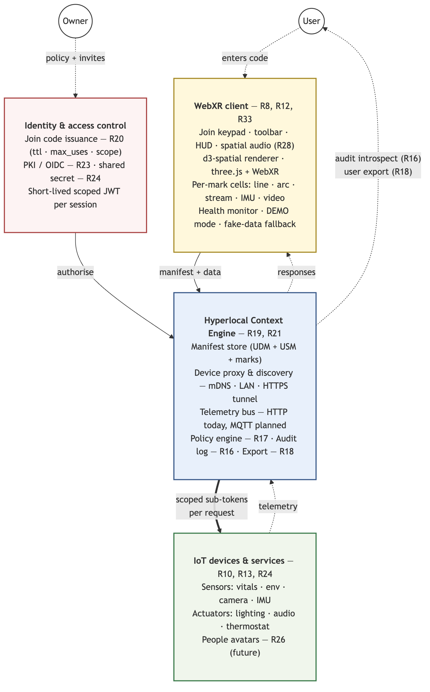

# The WebXR of Things

> **WebXR as the default interface for people, places, and things — at the hyperlocal scale, owned by the user.**

The *WebXR of Things* (XrOT) explores what happens when you put on a pair of mixed-reality glasses and **join the room you are standing in** — introspecting and controlling the devices, services, data, and (eventually) people around you, through open standards on a stack you own rather than a vendor's walled garden.

This directory holds the full proposal, the UX design work, the supporting research, and a working **open-source reference implementation** (`prototype/d3-spatial/`) that runs on Meta Quest 3 and Snap Spectacles today.

- 📄 Read the proposal: [`PROPOSAL.md`](./PROPOSAL.md) ([PDF](./PROPOSAL.pdf))
- 🕶 Run the reference implementation: [`prototype/d3-spatial/`](./prototype/d3-spatial/)
- 🎓 Conference: [Meaningful XR 2026](https://www.meaningfulxr.org/mxr26-program)

---

## The idea in one paragraph

IoT delivered powerful compute at the edge of the network — but it arrived as walled gardens. WebXR can browse *web pages* in 3D, but there is still **no standard way** to grab an HMD and "join" the local area to explore the services that physical devices expose. TVs, phones, and native apps all have richer local-discovery and device-control stories than WebXR does. XrOT proposes a **Hyperlocal Context Engine** and a **dataspace** abstraction: a short, memorable, owner-controlled namespace that binds an access policy, a manifest of what's present, a device/service proxy, and a WebXR client that renders all of it spatially — self-hosted, portable, and impossible for any single company to shut down. See [`PROPOSAL.md`](./PROPOSAL.md) for the full argument.

## Architecture

The **dataspace** is the central abstraction (proposal requirement R19): a user enters a join code at the WebXR keypad, exchanges it for a short-lived scoped token at the identity layer, and that token authorizes every request to the Hyperlocal Context Engine — manifest fetch, device proxy, telemetry bus — with per-request sub-tokens out to the devices and an append-only audit log the user can introspect.



*(Source: [`diagrams/dataspace-architecture.mmd`](./diagrams/dataspace-architecture.mmd) · regenerate via [`diagrams/render-diagrams.sh`](./diagrams/render-diagrams.sh). The security-focused join flow is in [`diagrams/join-code-interaction.png`](./diagrams/join-code-interaction.png).)*

---

## Progress to date

**Snapshot: 2026-05-21 (Milestone M22).** The reference implementation has carried the proposal from "diagram" to "four end-to-end use cases running on real hardware in a headset." Full milestone-by-milestone log: [`prototype/d3-spatial/STATUS.md`](./prototype/d3-spatial/STATUS.md).

### Four use cases shipping end-to-end

| | Theme | What's real | Doc |
|---|---|---|---|
| **UC1** | Personal vitals dataspace | mmWave HR/BR + simulated body-temp; ECG-style line + arc + streamgraph | — |
| **UC2** | Room dataspace | **Live ESP32-CAM** video, AHT20 temp/humidity, simulated AQI/baro/pollen, in-XR actuator panel (light + LED strip + thermostat + speaker) | [`uc2-room.md`](./prototype/d3-spatial/examples/uc2-room.md) |
| **UC3** | XRt Exhibit (curated art-data) | Voronoi stippling, 300° moon-phase arc, grabbable force-directed tree, ceiling owls with spatial mp3 hoots | [`uc3-poster.md`](./prototype/d3-spatial/examples/uc3-poster.md) |
| **UC4** | Airplane in-flight experience | **Live BMI270 attitude** (M5Capsule + Madgwick AHRS + gyro dead-reckoning), procedural cabin music, HLS cabin display, 3-scene Gaussian-splat photo gallery | [`uc4-airplane.md`](./prototype/d3-spatial/examples/uc4-airplane.md) |

Each use case is a real manifest-driven dataspace joined via the join-code flow (`DEMO01`–`DEMO04`), not hardcoded scene wiring.

### Platform & rendering (M0)
- WebXR `immersive-ar` boot with passthrough, eye-level UI anchor, heuristic floor grid (works around Spectacles' missing `local-floor`).
- Per-hand beam + reticle from controller targetRay or grip-space fallback — lights up for both Touch controllers and hand tracking.
- Warm-amber palette tuned for optical-waveguide passthrough (verified on Quest 3 and Spectacles '24).

### 24+ spatial mark types (M1–M22)
- **Charts:** line (live-streaming), bar, scatter, arc.
- **Hierarchies:** tree (radial/wall), treemap (extruded), sunburst, circular packing, tidy tree — all with animated drill-in, breadcrumbs, per-viz HUD.
- **Graphs:** force (d3-force-3d), tangled tree, edge bundling.
- **Distribution/multivariate:** ridgeline, parallel coordinates.
- **Flow/media:** sankey (3D flow tubes), video (HLS, MJPEG, polled-frames), Voronoi stippling, moon-phase arc, Gaussian-splat gallery.

### Interaction, audio, onboarding
- Hover with exit-debounce + press-lock, inspector cards, brush selection (pointer + XR sweep), multi-hand simultaneous drag, fingertip grab on hand tracking, live data streaming with tweened interpolation.
- Per-mark positional audio + Omnitone first-order-ambisonics ambient bed with head-pose rotation.
- Three-mesh-ui join panel with slot-wheel entry, mock JWT join server with rotating codes, manifest-driven scene rendering, configurable per-dataspace HUD / wrist hand-menu.

### Manifest schema (V1.9) & standards alignment
- `DataspaceManifest` TypeScript types + JSON Schema ([`prototype/d3-spatial/manifest.schema.json`](./prototype/d3-spatial/manifest.schema.json)), inline / URL / WebSocket data sources.
- Adopts IoTone **UDM** (Universal Device Metadata) + **USM** (Universal Service Metadata) microformats; adds the `udm_spatial_anchor` extension for room-scale device pinning (proposed upstream).

### Quality bar
- ~244 unit tests, ~99 Playwright headless screenshots across milestones, `typecheck` + `build` green. Full local dev loop documented in the prototype [README](./prototype/d3-spatial/README.md).

---

## Document index

### Specification & design (this directory)
| Document | What it is |
|---|---|
| [`PROPOSAL.md`](./PROPOSAL.md) · [`.pdf`](./PROPOSAL.pdf) | The core proposal — problem, solution, requirements R1–R33, architecture, UI Spec V1 status, known limitations, call to action. |
| [`XR_UX-proposal1.md`](./XR_UX-proposal1.md) | The UX field guide — onboarding flow, hyperlocal experiences, per-use-case interaction design, the hlxr-browser concept. |
| [`USECASE_SPECS.md`](./USECASE_SPECS.md) | Open decisions and build-out checklist per use case (UC1–UC4) plus cross-cutting deployment questions. |
| [`JOINCODE_SPEC.md`](./JOINCODE_SPEC.md) | V1.1 implementation spec for the join-code onboarding flow — protocol, state machine, error handling. |
| [`VIDEO_STREAMING_ANALYSIS.md`](./VIDEO_STREAMING_ANALYSIS.md) | Research comparing HLS / MJPEG / WebRTC / polled-frames approaches for live video marks in XR. |
| [`ROADMAP.md`](./ROADMAP.md) | Phased plan from "connect the join flow" through multi-user, production quality, and platform expansion. |
| [`diagrams/`](./diagrams/) | Mermaid sources + rendered PNG/SVG for the architecture and join-code diagrams. |
| `conference-poster.pptx` | Meaningful XR 2026 poster. |

### Reference implementation (`prototype/d3-spatial/`)
| Document | When to read it |
|---|---|
| [`README.md`](./prototype/d3-spatial/README.md) | Quick start — run it on a headset in two terminals. |
| [`DEVELOPER_GUIDE.md`](./prototype/d3-spatial/DEVELOPER_GUIDE.md) | **Start here to build your own dataspace** — manifest authoring, mark types, device wiring, deployment. |
| [`API.md`](./prototype/d3-spatial/API.md) | Class-by-class library reference. |
| [`STATUS.md`](./prototype/d3-spatial/STATUS.md) | Implementation status, known issues, and the **deferred-capabilities** ledger (everything the spec proposes but isn't built yet). |
| [`CONTRIBUTING.md`](./prototype/d3-spatial/CONTRIBUTING.md) | How to extend d3-spatial itself — new marks, palette rules, code style. |
| [`XR_UX_BEST_PRACTICES.md`](./prototype/d3-spatial/XR_UX_BEST_PRACTICES.md) | Lessons learned on-device (Quest 3, Spectacles). |
| [`CAMERA_SETUP.md`](./prototype/d3-spatial/CAMERA_SETUP.md) | ESP32-CAM → cloudflared → Vite-proxy video pipeline. |
| [`DESIGN_NOTES.md`](./prototype/d3-spatial/DESIGN_NOTES.md) · [`test-plan.md`](./prototype/d3-spatial/test-plan.md) · [`examples/`](./prototype/d3-spatial/examples/) | Design-decision history, on-device test scripts, per-UC walkthroughs. |

---

## Future direction

The spec set is broad; the prototype proved the core path. The work ahead is captured in [`ROADMAP.md`](./ROADMAP.md) and the deferred-capabilities ledger in [`STATUS.md`](./prototype/d3-spatial/STATUS.md). Highlights:

**Connect the stack to a real engine (near-term).**
- Replace the mock JWT server with a real Hyperlocal Context Engine: MQTT bridge to a project-level broker, WebSocket live streams in the manifest, device-side **auto-onboarding via shared secret** (R24/R32).
- **Live service discovery** — devices auto-register; runtime mDNS resolution wired through the dev proxy (see the prototype's `specs/device-self-registration.md`).

**Multi-user & shared experience (Phase 2 / UI Spec V1.7).**
- Signaling server for shared presence — peer beams/reticles as ghost avatars, propagated interactions, coordination locks on critical controls (R31). This also unblocks **V1.4 people introspection**.

**Production quality (Phase 3).**
- **Security:** PKI/OIDC challenge for private dataspaces (R23), token refresh, data-layer cross-dataspace isolation (today it's visual dim only).
- **Continuous-awareness HUD (V1.2):** TLS/PKI lock, latency sparkline, battery, device count.
- **Device control pucks (V1.3):** hue wheel / brightness slider / scene presets rendered from a device's self-described schema, plus room-anchored device pins via `udm_spatial_anchor`.
- Bundle splitting, 90 fps at 500+ nodes, and an **accessibility layer** (visible equivalent for every audio cue, reduced-motion, high-contrast) — currently the biggest gap.
- **Persistence/portability:** "take it with you" gesture (UC3), offline manifest cache (UC4), dataspace export to alternate engines (R18), Japanese localization.

**Platform expansion (Phase 4).**
- **hlxr-browser** — a Wolvic fork with a join-panel home screen, user-managed root-CA store, and Tier-2 device APIs (WebBLE, Web MIDI, WebUSB/Serial).
- Apple Vision Pro / Pico / Lynx test passes.

### The bigger ask

WebXR's limitations are the real blocker — no non-HTTPS URIs, no WebBLE/MIDI/USB in HMD browsers, no front-camera access, no user-installable root CAs, and HMD browsers that lag native apps badly. The proposal closes with a call to action: pressure XR browser vendors for these features, and back **open hardware** — a sub-$800, Linux/Android, true-passthrough HMD that any ODM can build. Contributions and collaborators welcome; this is a meritocracy, not a standards body.

---

## Citation

```bibtex
@misc{kordsmeier2026thewebxrofthings,
      title={The WebXR Of Things: A Proposal for WebXR as the default interface for people, places and things},
      author={David J. Kordsmeier},
      year={2026},
      primaryClass={cs.XR},
      url={https://www.meaningfulxr.org/mxr26-program}
}
```

*Inspiration concept: Adam Varga. Reference implementation is MIT-licensed open source.*
